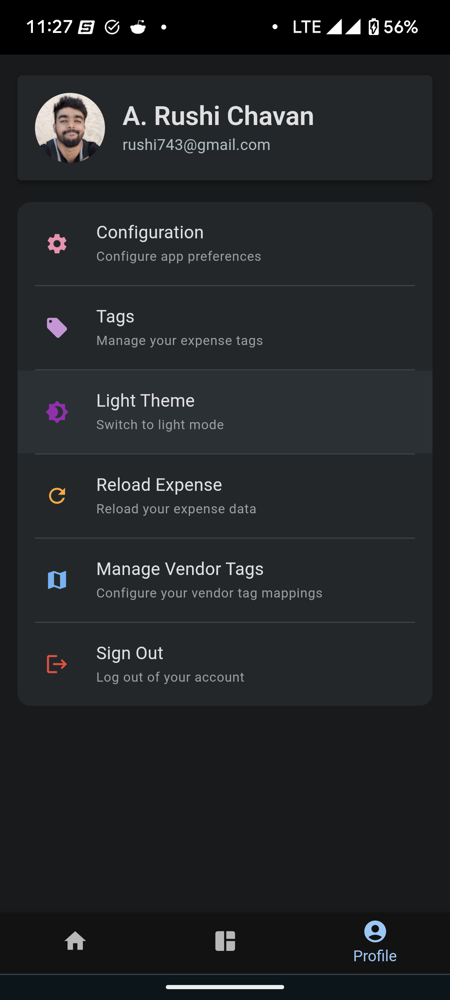
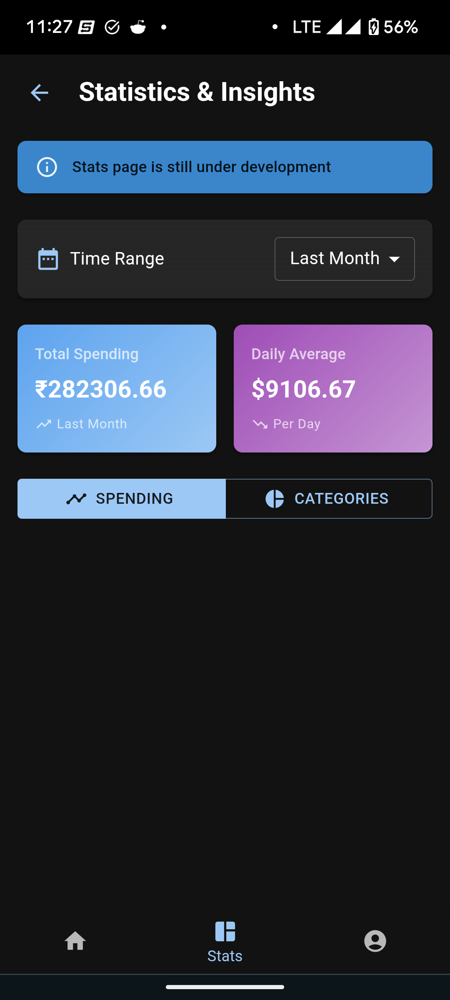
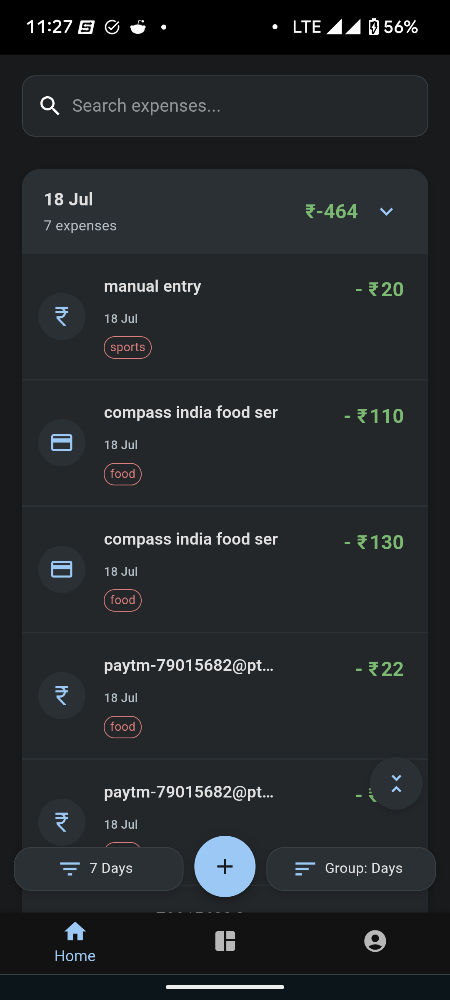
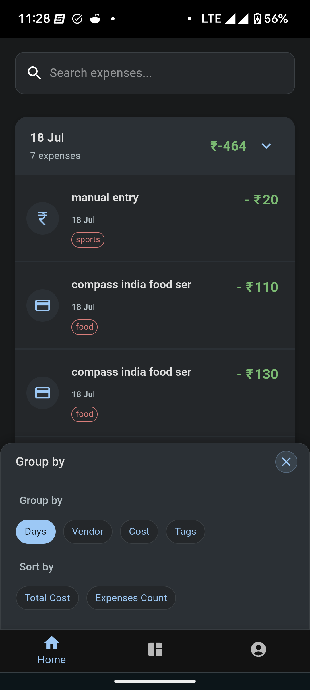
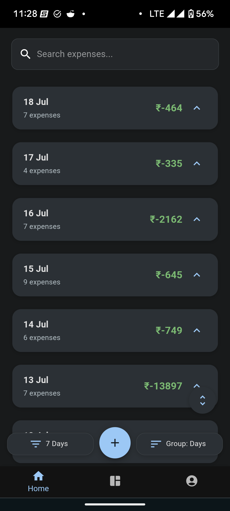
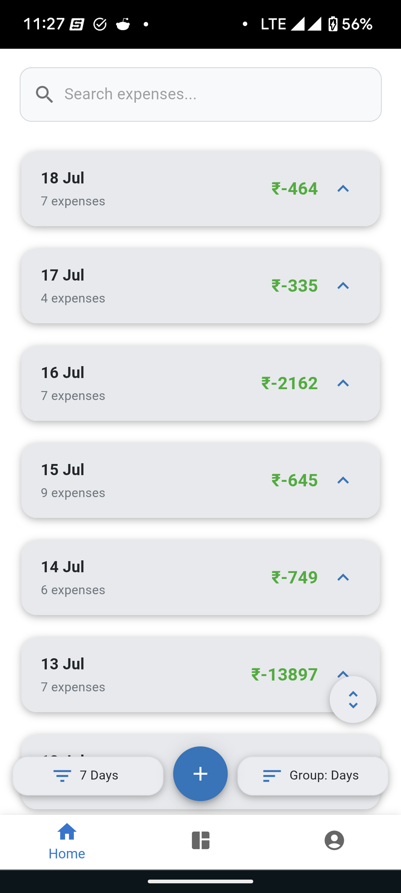
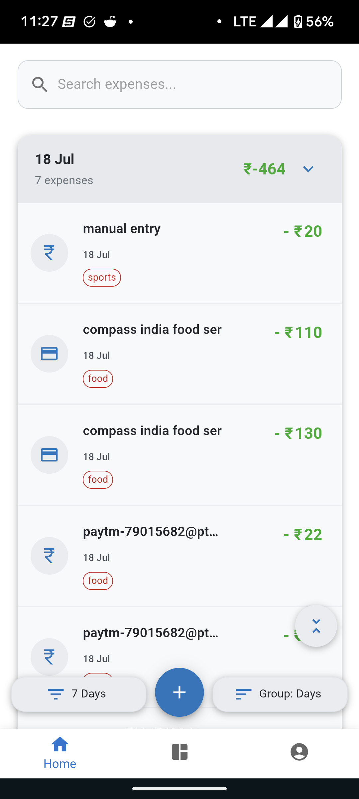
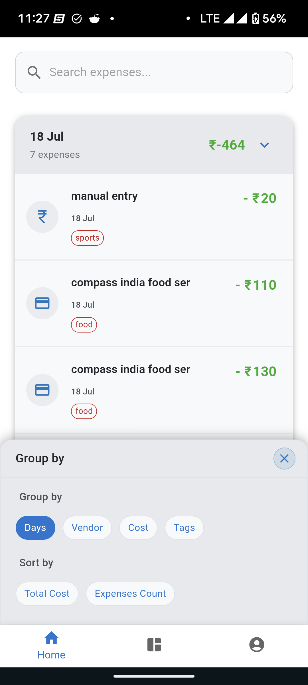
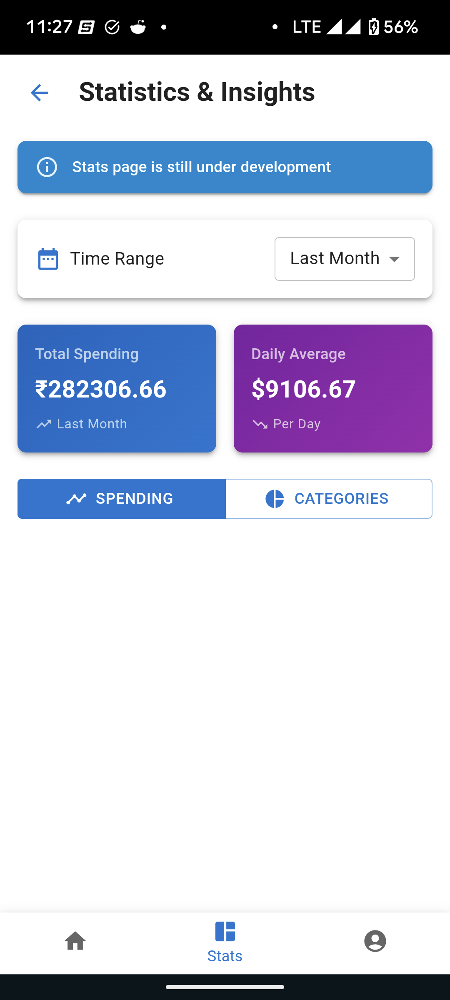
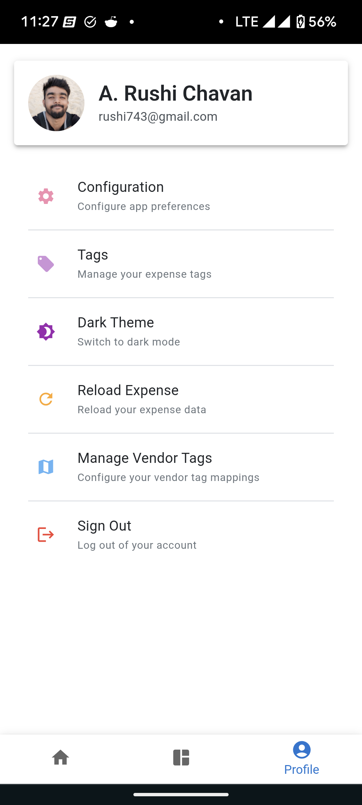

# PennyWise: Personal Expense Tracker

> **Disclaimer:** Currently, PennyWise only supports transaction tracking for below
> * HDFC UPI credit & debit transactions.
> * HDFC Credit card debit transactions.
>
> We are actively working on expanding support to other banks and transaction types.

<div align="center">
  
  <br />
  <strong>Track, Analyze, and Master Your Personal Finances</strong>
</div>

<p align="center">
  <a href="#overview">Overview</a> •
  <a href="#features">Features</a> •
  <a href="#demo">Demo</a> •
  <a href="#technology-stack">Tech Stack</a> •
  <a href="#architecture-how-it-works">Architecture & How It Works</a> •
  <a href="#project-structure">Project Structure</a> •
  <a href="#getting-started">Getting Started</a> •
  <a href="#roadmap">Roadmap</a> •
  <a href="#contributing">Contributing</a> •
  <a href="#license">License</a>
</p>

---

## Overview

PennyWise is a comprehensive, open-source web application designed to empower individuals in managing their personal finances. It provides an intuitive platform to track, categorize, and visualize expenses, helping users gain clear insights into their spending patterns and achieve financial mastery. Built with modern web technologies, PennyWise offers a user-friendly experience with robust features, including offline support and secure authentication.

## Features

* 📊 **Expense Tracking**: Easily add, edit, and manage your daily expenses with detailed inputs.
* 🏷️ **Tagging System**: Categorize expenses with custom tags for flexible and granular organization.
* 📅 **Date Filtering**: Filter expenses by various time periods (e.g., 1 day, 7 days, 2 weeks, custom ranges) for focused analysis.
* 📊 **Visualization**: Understand spending patterns at a glance through interactive statistical charts and graphs.
* 🔄 **Offline Support**: Access and manage your data even without an internet connection, thanks to IndexedDB for local storage.
* 🔒 **Google Authentication**: Secure and convenient login via Google OAuth for user management.
* 📧 **Gmail Integration**: Effortlessly scan your emails to automatically identify and import expense information.

## Demo

[Live Demo](#) - Coming Soon!

Experience PennyWise in action:

<div align="center">
    
    
    
    
    
    
    
    
    
    
    
    
  <p><em>Scroll horizontally to see all features →</em></p>
</div>

---

## Technology Stack

PennyWise leverages a modern and robust set of technologies to deliver a high-performance and maintainable application.

### Frontend
* **UI Framework**: [React](https://reactjs.org/)
* **Type Safety**: [TypeScript](https://www.typescriptlang.org/)
* **Component Library**: [Material-UI v6](https://mui.com/)
* **Animations**: [Framer Motion](https://www.framer.com/motion/)

### State Management
* **Centralized State**: [Redux Toolkit](https://redux-toolkit.js.org/)

### Data Storage
* **Cloud Database**: [Firebase Firestore](https://firebase.google.com/docs/firestore)
* **Offline Storage**: [IndexedDB](https://developer.mozilla.org/en-US/docs/Web/API/IndexedDB_API) (via [idb](https://www.npmjs.com/package/idb) library)

### Authentication
* **OAuth Provider**: [Google OAuth](https://developers.google.com/identity/protocols/oauth2) (integrated using [@react-oauth/google](https://www.npmjs.com/package/@react-oauth/google))

### Utilities
* **Date Manipulation**: [date-fns](https://date-fns.org/) & [luxon](https://moment.github.io/luxon/)
* **HTTP Client**: [axios](https://axios-http.com/)

---

## Architecture: How It Works

PennyWise is designed with a client-side architecture emphasizing performance, offline capability, and seamless data synchronization. Below is an overview of its core components and data flow.

### High-Level Architecture View

## Getting Started

### Prerequisites

- Node.js (v20+)
- npm or yarn
- Firebase account (for deployment)
- Google OAuth credentials (for authentication)

### Installation

1. Clone the repository:
   ```bash
   git clone https://github.com/yourusername/pennywise.git
   cd pennywise
   ```

2. Install dependencies:
   ```bash
   npm install
   # or
   yarn install
   ```

3. Set up Firebase configuration:
   - Create a Firebase project at [Firebase Console](https://console.firebase.google.com/)
   - Enable Firestore, Authentication with Google provider
   - Create a `.env` file based on `.env.example` and add your Firebase configuration

4. Start the development server:
   ```bash
   npm start
   # or
   yarn start
   ```

5. Open your browser to `http://localhost:3000`

### Deployment

To deploy to Firebase:

```bash
npm run build
firebase deploy
```

## Project Structure

```
pennywise/
├── public/               # Static assets
├── src/
│   ├── api/              # API clients and data fetching
│   │   ├── BaseApi.ts
│   │   ├── ExpenseAPI.ts
│   │   └── FinanceIndexDB.ts
│   ├── components/       # Reusable UI components
│   ├── firebase/         # Firebase configuration & utilities
│   ├── hooks/            # Custom React hooks
│   ├── pages/            # Application pages & views
│   │   ├── home/         # Main dashboard
│   │   ├── login/        # Authentication flow
│   │   ├── setting/      # Application settings
│   │   └── stats/        # Statistical views
│   ├── store/            # Redux store configuration
│   └── utility/          # Helper functions & constants
├── functions/            # Firebase Cloud Functions
└── appScript/            # Google Apps Script for email integration
```

## Architecture

PennyWise is built using a modern front-end architecture with the following key components:

### Technology Stack

- **Frontend**:
  - [React](https://reactjs.org/) - UI framework
  - [TypeScript](https://www.typescriptlang.org/) - Type safety
  - [Material-UI v6](https://mui.com/) - Component library
  - [Framer Motion](https://www.framer.com/motion/) - Animations

- **State Management**:
  - [Redux Toolkit](https://redux-toolkit.js.org/) - Centralized state

- **Storage**:
  - [Firebase Firestore](https://firebase.google.com/docs/firestore) - Cloud database
  - [IndexedDB](https://developer.mozilla.org/en-US/docs/Web/API/IndexedDB_API) (via [idb](https://www.npmjs.com/package/idb)) - Offline storage

- **Authentication**:
  - [Google OAuth](https://developers.google.com/identity/protocols/oauth2) (via [@react-oauth/google](https://www.npmjs.com/package/@react-oauth/google))

- **Utilities**:
  - [date-fns](https://date-fns.org/) & [luxon](https://moment.github.io/luxon/) - Date manipulation
  - [axios](https://axios-http.com/) - HTTP client

### Data Flow

1. **User Authentication**: Users authenticate using Google OAuth
2. **Data Fetching**:
   - On app initialization, data is fetched from Firebase Firestore
   - Data is stored locally in IndexedDB for offline access
   - Redux store is populated with expense and tag data
3. **User Interactions**:
   - Users can view, filter, and group expenses
   - New expenses can be added manually or imported
   - Expenses can be tagged for categorization
4. **Data Persistence**:
   - Changes are saved to both IndexedDB and Firebase
   - Data synchronization happens automatically when online

### Data Flow Diagram

```
┌──��──────────┐     ┌───────────────┐     ┌───────────────┐
│             │     │               │     │               │
│  User Input ├────►│ React UI/Views├────►│ Redux Actions │
│             │     │               │     │               │
└────────────��┘     └───────┬───────┘     └───────┬───────┘
                            │                     │
                            │                     ▼
┌─────────────┐     ┌───────▼───────┐     ┌───────────────┐
│             │     │               │     │               │
│    Google   │     │  Redux Store  │◄────┤ Redux Reducers│
│    OAuth    │     │               │     │               │
│             │     └───────┬───────┘     └───────────────┘
└──────┬──────┘             │
       │                    │
       ▼                    ▼
┌─────────────┐     ┌───────────────┐     ┌────────────────┐
│             │     │               │     │                  │
│ App.tsx     ├────►│  ExpenseAPI   ├────►│ FinanceIndexDB   │
│Initial Load │     │               │     │ (Local Cache)    │
└─────────────┘     └───────┬───────┘     └───────┬────────┘
                            │                     │
                            ▼                     │
                    ┌───────────────┐             │
                    │               │             │
                    │   Firebase    │◄────────────┘
                    │  Firestore    │  (Sync when online)
                    │               │
                    └───────────────┘
```

### Enhanced Architecture View

```
┌──────────────────────────────────────────────────────────────────┐
│                        Client Application                        │
│                                                                  │
│  ┌─────────────┐    ┌───────────────┐    ┌──────────────────┐    │
│  │             │    │               │    │                  │    │
│  │    Pages    │◄──►│  UI Components│◄───┤  State (Redux)   │    │
│  │             │    │               │    │                  │    │
│  └─────────────┘    └───────────────┘    └────────┬─────────┘    │
│                                                   │              │
│  ┌─────────────────────────────────────┐          │              │
│  │                                     │          │              │
│  │       Data Access Layer             │◄─────────┘              │
│  │  (API Clients & Data Processing)    │                         │
│  │                                     │                         │
│  └──────────────────┬───���────────────┘                         │
���                     │                                            │
└─────────────────────┼────────────────────────────────────────────┘
                      │
                      ▼
     ┌──────────────────────────��─┐       ┌──────────────────────────┐
     │                            │       │                          │
     │      Local Storage         │◄─────►│     Cloud Storage        │
     │      (IndexedDB)           │       │   (Firebase Firestore)   │
     │                            │       │                          │
     └────────────────────────────┘       └─────────────────────��────┘

             │                                        │
             ▼                                        ▼
    ┌────────────────┐                     ┌────────────────────┐
    │                │                     │                    │
    │  Offline Mode  │                     │  Online Features   │
    │                │                     │                    │
    └────────────────┘                     └────────────────────┘
```

## Core Components

- **Home**: Main dashboard showing expense list with filtering and grouping options
- **TagExpenses**: Interface for tagging and categorizing expenses
- **Statistics**: Visualizations and charts of spending patterns
- **Settings**: Application configuration and user profile management

## Data Models

### Expense

The core data model representing a financial transaction:

```typescript
interface Expense {
    id: string,
    tag: string,
    mailId: string,
    cost: number,
    costType: string,
    date: Date,
    user: string,
    type: 'credit' | 'debit',
    vendor: string
}
```

## Roadmap

- [ ] Statistical page with useful graphs
- [ ] Improved Desktop UX
- [ ] Expense predictions using historical data (Firebase AI Logic)
- [ ] Multiple bank support
- [ ] Expense sharing/tracking between users
- [ ] Data export options (CSV, PDF)

## Contributing

Contributions are welcome! Please feel free to submit a Pull Request.

1. Fork the repository
2. Create your feature branch (`git checkout -b feature/amazing-feature`)
3. Commit your changes (`git commit -m 'Add some amazing feature'`)
4. Push to the branch (`git push origin feature/amazing-feature`)
5. Open a Pull Request to main branch

Please ensure your code follows the project's and general coding standards.

## License

This project is licensed under the MIT License - see the [LICENSE](LICENSE) file for details.

## Acknowledgments

- Icon made by [Freepik](https://www.freepik.com) from [Flaticon](https://www.flaticon.com/)
- [Material-UI](https://mui.com/) for the beautiful components
- [Firebase](https://firebase.google.com/) for backend services
