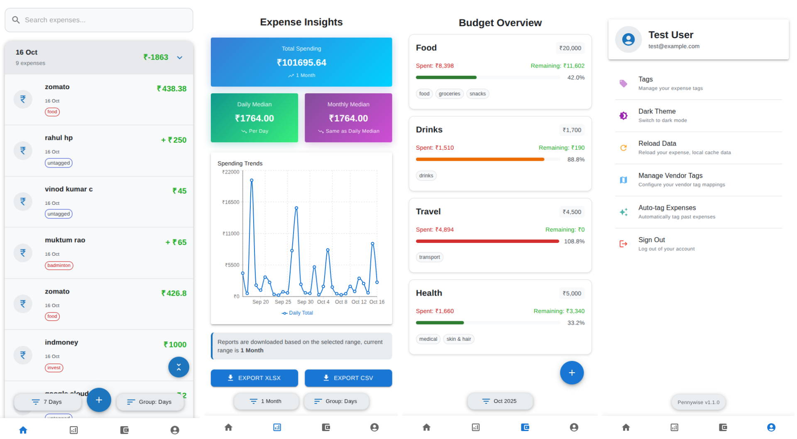
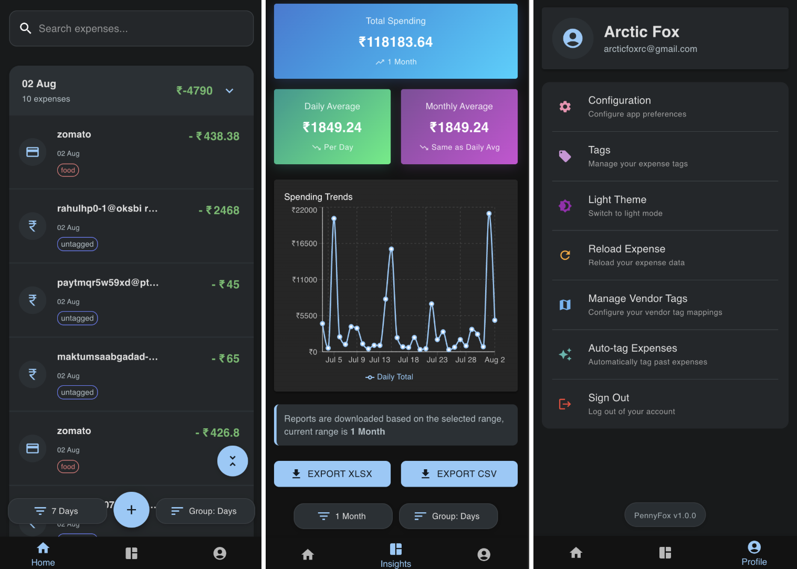
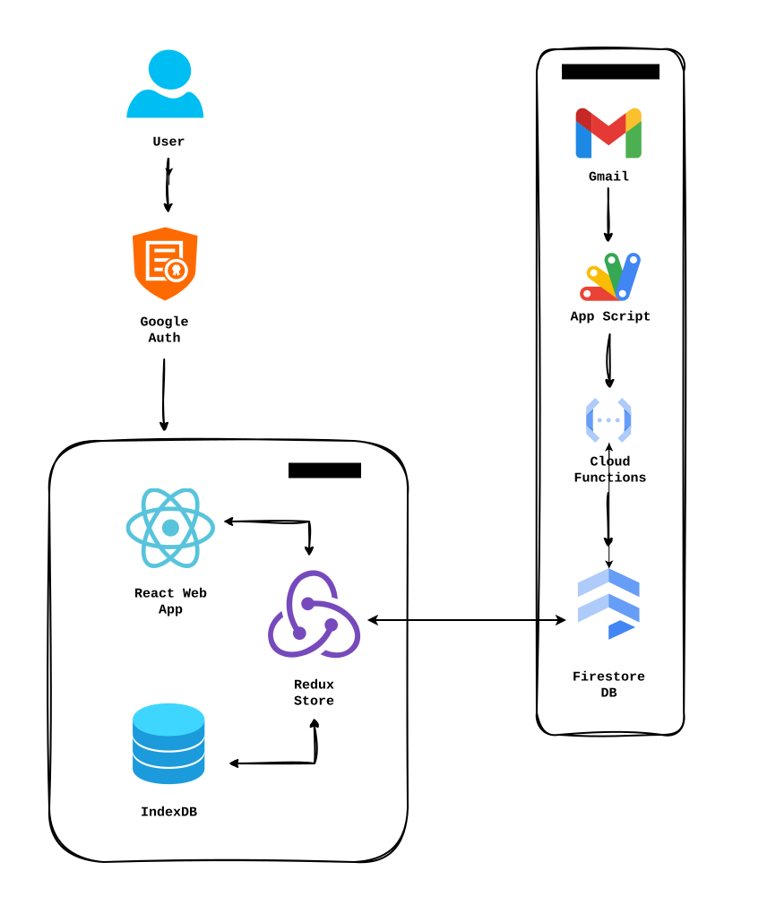

<div align="center">
  <br/>
  
  <h1>Pennywise</h1>
  <h3>Track, Analyze, and Master Your Personal Finances</h3>
</div>

<p align="center">
  <a href="#license">License</a> •
  <a href="#overview">Overview</a> •
  <a href="#features">Features</a> •
  <a href="#demo">Demo</a> •
  <a href="#getting-started">Getting Started</a> •
  <a href="#Security-and-Cost">Security and Cost</a> •
  <a href="#technology-stack">Tech Stack</a> •
  <a href="#architecture">Architecture</a> •
  <a href="#project-structure">Project Structure</a> •
  <a href="#Future-Roadmap">Future Roadmap</a> •
  <a href="#support-the-project">Support Project</a>
</p>

---
> **Disclaimer:** Currently, Pennywise supports transaction tracking for the following:
> * HDFC UPI — credit & debit transactions
> * HDFC Credit Card — debit transactions only
> * HDFC E-mandate transactions
> * SBI Credit Card — debit transactions only
>
> We are actively working on expanding support to additional banks, email formats, and transaction types.

## License

This project is licensed under the [MIT License](LICENSE).


## Overview

Pennywise is a comprehensive, open-source web application designed to empower individuals in managing their personal
finances. It provides an intuitive platform to track, categorize, and visualize expenses, helping users gain clear
insights into their spending patterns and achieve financial mastery. Built with modern web technologies, Pennywise offers
a user-friendly experience with robust features, including offline support and secure authentication.

## Features

* 📊 **Expense Tracking**: Easily add, edit, and manage your daily expenses with detailed inputs.
* 📧 **Gmail Integration**: Effortlessly scan your emails to automatically identify and import expense information.
* 🏷️ **Tagging System**: Categorize expenses with custom tags for flexible and granular organization.
* 🤖 **Auto Tagging**: Cloud functions automatically apply tags to new expenses based on previously user-marked
  vendor-tag associations.
* 📅 **Date Filtering**: Filter expenses by various time periods (e.g., 1 day, 7 days, 2 weeks, & more) for focused
  analysis.
* 📊 **Visualization**: Understand spending patterns at a glance through interactive statistical charts and graphs.
* 🔄 **Offline Caching**: Data is cached locally using IndexedDB to reduce Firestore queries, but the app requires
  internet connectivity to function fully.
* 🔒 **Google Authentication**: Secure and convenient login via Google OAuth for user management.

## Demo
- Google Auth and Firestore are disabled in the demo app. All demo data is stored in a static file to reduce costs.
- This is a static variation of the website, which means you can explore the app without needing to sign in.

<p align="center">
  <a
    href="https://pennywise-static.web.app"
    target="_blank"
    rel="noopener noreferrer"
    style="display: inline-block; padding: 10px 20px; background-color: #4CAF50; color: white; text-decoration: none; border-radius: 5px;"
   >
    Explore Pennywise Demo App
  </a>
</p>




## Getting Started

For detailed setup instructions, please refer to the guide below (30–60 minute setup time).

<p align="center">
  <a href="SETUP.md" target="_blank" rel="noopener noreferrer" style="display: inline-block; padding: 10px 20px; background-color: #008CBA; color: white; text-decoration: none; border-radius: 5px;">
    View Setup Instructions
  </a>
</p>

## Security and Cost

Pennywise is designed with your data privacy and security as a top priority. Unlike many other financial apps, Pennywise
gives you complete control over your data and infrastructure. Here’s what makes our approach to security different:

* **🔒 You Own Your Data**: Your financial data is yours alone. It is stored in your own Google Firebase Firestore
  instance, not on our servers. You have full control over who can access it.

* **☁️ Self-Hosted on Your Google Cloud**: You deploy Pennywise on your personal Google Cloud project. This means you
  manage the entire infrastructure, ensuring that you are the only one with access to the backend services and database.

* **💸 No Hidden Costs**: Pennywise is open-source and free to use. You only pay for what you use on the Google Cloud
  Platform, which offers a generous free tier for Firebase and Cloud Functions.

* **🚫 No Ads, No Tracking**: Pennywise is a completely ad-free platform. We do not track your behavior or sell your data
  to third parties. Our goal is to provide a tool that helps you manage your finances, not to monetize your personal
  information.

* **📖 Open Source Transparency**: The entire codebase is open-source. You can inspect the code yourself to verify that
  there are no hidden trackers or malicious logic. This transparency ensures that we are accountable to our users.

* **🔐 Secure Authentication**: We use Google OAuth for authentication, which provides a secure and reliable way to log
  in to your account without us ever seeing or storing your password.

* **🔑 Minimal Permissions**: Pennywise requests only the necessary permissions to function. For instance, the Gmail
  integration is designed to only access emails related to financial transactions, ensuring the privacy of your personal
  correspondence.

* **⚙️ You Control Updates**: Since you host the application, you are in full control of when and how you update it. You
  will never be forced into an update that changes the functionality or privacy in a way you don't agree with.

* **🔒 Secured Infrastructure**: All backend services on Google Cloud are protected by Google's authentication mechanisms,
  including the infrastructure exposed to the public internet. This ensures that only authenticated requests from
  your application can access your data and services.

By putting you in control of your data and the application's infrastructure, Pennywise offers a transparent and secure
way to manage your personal finances.

For a detailed explanation of the security architecture, please see the [Security Policy](SECURITY.md).

## Technology Stack

Pennywise leverages a modern and robust set of technologies to deliver a user-friendly and maintainable application.

### Frontend

* **UI Framework**: [React](https://reactjs.org/)
* **Type Safety**: [TypeScript](https://www.typescriptlang.org/)
* **Component Library**: [Material-UI v6](https://mui.com/)
* **Animations**: [Framer Motion](https://www.framer.com/motion/)
* **Charts**: [Recharts](https://recharts.org/en-US/)

### State Management

* **Centralized State**: [Redux Toolkit](https://redux-toolkit.js.org/)

### Data Storage

* **Cloud Database**: [Firebase Firestore](https://firebase.google.com/docs/firestore)
* **Offline Storage**: [IndexedDB](https://developer.mozilla.org/en-US/docs/Web/API/IndexedDB_API) (
  via [idb](https://www.npmjs.com/package/idb) library)

### Authentication

* **OAuth Provider**: [Google OAuth](https://developers.google.com/identity/protocols/oauth2) (integrated
  using [@react-oauth/google](https://www.npmjs.com/package/@react-oauth/google))

### Utilities

* **Date Manipulation**: [dayjs](https://day.js.org/)
* **HTTP Client**: [axios](https://axios-http.com/)

## Project Structure

```
pennywise/
├── appScript/              # Google Apps Script for email integration
├── build/                  # Production build output
├── commands/               # Build and deployment scripts
├── functions/              # Firebase Cloud Functions
├── node_modules/           # Node.js dependencies
├── public/                 # Static assets served directly
├── scripts/                # Build and utility scripts
└── src/                    # React application source code
    ├── api/                # API clients and data fetching
    ├── components/         # Reusable UI components
    ├── firebase/           # Firebase configuration & utilities
    ├── hooks/              # Custom React hooks
    ├── pages/              # Application pages & views
    │   ├── budget/         # Budget management pages
    │   ├── home/           # Main dashboard and expense views
    │   ├── insights/       # Analytics and insights pages
    │   ├── login/          # Authentication flow
    │   └── setting/        # Application settings
    ├── store/              # Redux store configuration
    ├── styles/             # Global styles and themes
    └── utility/            # Helper functions & constants
```

## Architecture

Pennywise is built using a modern front-end architecture with the following key components:

### Overview

1. **User Authentication**:
  - Users authenticate using Google OAuth
2. **Data Fetching**:
  - On app initialization, data is fetched from Firebase Firestore
  - Data is stored locally in IndexedDB for offline access
  - Redux store is populated with expense and tag data
3. **User Interactions**:
  - Users can view, filter, and group expenses
  - New expenses can be added manually or imported
  - Expenses can be tagged for categorization
4. **Data Persistence**:
  - Changes are saved to both IndexedDB and Firebase
  - Data synchronization happens automatically when online

### Architecture Diagram



## Application Sections

The React application is divided into several key sections, each serving a specific purpose. Below is a short developer-friendly summary of what each area does.

### Home
The Home screen is the main dashboard and the primary place to view and manage transactions. Key capabilities:
- View a chronological list of recent transactions with amounts, dates, vendors, and tags.
- Add new expenses manually using a compact form.
- Edit or delete existing expenses.
- Apply quick filters (date ranges, tags, vendors) and grouping (daily, weekly, monthly) to analyze recent activity.
- Mark transactions with tags for categorization and let cloud functions learn vendor→tag associations for future auto-tagging.

### Insights
Insights offers visual analytics to help you understand spending patterns:
- Interactive charts and graphs that break down spending by tag, vendor, and time period.
- Trend views to spot increases or decreases in category spending over time.
- Exportable reports (XLSX & CSV) for offline analysis or sharing.
- Drill-down support to view the underlying transactions that contribute to any chart segment.

### Budget
The Budget section helps you set and track financial goals:
- Create monthly budgets per tag/category.
- See progress vs budget in percentage and absolute terms.
- Receive visual alerts when you approach or exceed a budget.
- Compare actual spending to budgeted amounts across months to identify recurring overspend.

### Settings
Settings lets you customize the application and manage account-level configuration:
- Manage tags (create, rename, delete) used for categorizing expenses.
- Review and edit pre-mapped vendor→tag configurations used by the auto-tagging engine.
- View and edit user profile information.
- Configure app-specific preferences such as default currency, date range shortcuts, and sync behavior.

## Future Roadmap

- [ ] Multiple bank support (We need people with different bank accounts to help us with this)
- [ ] Google pub sub integration for real-time event driven updates instead of using AppScript as hourly jobs
- [ ] Enhancing Insights with more detailed analytics & better graph support grouped by category
- [ ] Multi-selected expense tagging feature
- [ ] Expense analysis using historical data (Firebase AI Logic)
- [ ] Expense sharing/tracking between users (Multi-user persona)

## Contributing & Local Development

We welcome contributions to Pennywise! If you're interested in helping out, please refer to our [Development Guide](DEVELOP.md) for instructions on setting up the project locally, contributing code, and submitting pull requests.


## Support the Project

<a href="https://www.buymeacoffee.com/arcticfoxrc"></a>

---
<div align="center">
  <p>Created with ❤️ by <a href="https://github.com/rushikc"> rushikc </a> & <a href="https://github.com/features/copilot">Copilot</a></p>
  <p>rushikc.dev@gmail.com</p>
</div>
