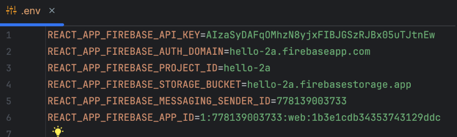

# Pennywise Setup

This guide will walk you through setting up the Pennywise project on a Linux/Microsoft/MacOs environment.

## Prerequisites

- **Firebase Blaze Plan**: To use this project, you'll need to enable the Firebase "Blaze" (pay-as-you-go) plan. This
  requires adding a billing account to your Firebase project, for which a credit card is mandatory.


- **Govt ID Verification**: Please note that a Google Cloud billing account requires valid ID verification.
  While this is not an immediate blocker, and you can proceed with the initial setup,
  Google will eventually require verification to continue using the services (it will stop services after few weeks).
  You will get email from Google cloud team with detailed steps.


- **Free Tier Usage**: The Firebase Blaze plan offers genrous free tier limits, which should be sufficient for most personal use cases. https://firebase.google.com/pricing
    - 1 GB of storage in Firestore.
    - 50,000 reads, 20,000 writes, and 20,000 deletes per day
    - 1 GB of data transfer per month
    - 1 GB of storage in Firebase Storage
    - 1 GB of data transfer in Firebase Hosting
    - 1 GB of data transfer in Firebase Functions
    - 1 GB of data transfer in Firebase Authentication

> **Note:** I have been using this project for tracking my expenses for the last 2 years, and I have rarely crossed the
> free tier limits. Occasionally, I was billed ₹1-2 when I was testing Firestore with a high volume of requests.
> However, you can set up a billing budget to receive reminder emails, which helps ensure you stay within your desired
> spending limits.

## Minimum Technical Requirements

Before you begin, please ensure you have the following minimum versions installed on your system:

- **Node.js:** `v22.0.0` or higher
- **npm:** `v10.0.0` or higher

## Recommended Code Editor

We strongly recommend using a code editor like Visual Studio Code for this project. A dedicated code editor will make it much easier to:

- See and edit hidden files (like `.env` or `.firebaserc` files) that standard file explorers might hide
- Edit code with syntax highlighting
- Navigate the project structure efficiently

**Visual Studio Code:**
- Download VS Code from [https://code.visualstudio.com/download](https://code.visualstudio.com/download)

Other suitable code editors include:
- [Sublime Text](https://www.sublimetext.com/)
- [Atom](https://atom.io/)
- [WebStorm](https://www.jetbrains.com/webstorm/)

### Cloning the Project

You can get the project files either by cloning the repository using Git or by downloading the source code as a ZIP file.

- ** With VS Code:**
  1. Open Visual Studio Code.
  2. Follow this guide to clone a repository -
  3. https://code.visualstudio.com/docs/sourcecontrol/intro-to-git#_clone-a-repository-locally
  4. Repository URL mentioned below
   ```bash
      https://github.com/rushikc/pennywise.git
   ```
  

- **With Git:**
  ```bash
  git clone https://github.com/rushikc/pennywise.git
  ```
- **Direct Download:**
  Alternatively, you can download the project as a ZIP file from the repository's main page and extract it.
  go to https://github.com/rushikc/pennywise, click on Code button, then click on Download ZIP.

After cloning or extracting the project, you need to open a terminal and navigate to the project's root directory.

<details>
<summary>Windows</summary>

1.  **Open Terminal:** Right-click the Start button and select **Windows PowerShell** or **Command Prompt**.
2.  **Navigate to Directory:** Use the `cd` command. For example, if the project is in your `Downloads` folder, run:
    ```cmd
    cd C:\\Users\\YourUsername\\Downloads\\pennywise
    ```

</details>

<details>
<summary>macOS</summary>

1.  **Open Terminal:** Find the Terminal app in `Applications/Utilities` or search for it with Spotlight (`Cmd+Space`).
2.  **Navigate to Directory:** Use the `cd` command. For example:
    ```bash
    cd ~/Downloads/pennywise
    ```

</details>

<details>
<summary>Linux</summary>

1.  **Open Terminal:** Press `Ctrl+Alt+T` or search for "Terminal" in your applications menu.
2.  **Navigate to Directory:** Use the `cd` command. For example:
    ```bash
    cd ~/Downloads/pennywise
    ```

</details>


### Installing Node.js and npm

Here’s how you can install Node.js and npm on different operating systems. We recommend using a version manager like
`nvm` or `nvs` to make it easy to switch between Node.js versions.

<details>
<summary>Linux (using nvm)</summary>

1. **Install nvm (Node Version Manager):**
   Open your terminal and run the following command to install `nvm`:
   ```bash
   curl -o- https://raw.githubusercontent.com/nvm-sh/nvm/v0.39.3/install.sh | bash
   ```
   After the installation, restart your terminal or run `source ~/.bashrc` (or `~/.zshrc`) to apply the changes.

2. **Install Node.js:**
   Now, you can install the latest LTS version of Node.js with:
   ```bash
   nvm install --lts
   nvm use --lts
   ```
   This will also install the corresponding version of `npm`.

3. **Verify the Installation:**
   Run the following commands to ensure everything is set up correctly:
   ```bash
   node -v
   npm -v
   ```

</details>

<details>
<summary>Windows (using the official installer)</summary>

1. **Download the Installer:**
   Go to the [official Node.js website](https://nodejs.org/en/download/) and download the Windows Installer (`.msi`) for
   the LTS version.

2. **Run the Installer:**
    - Double-click the downloaded `.msi` file.
    - Follow the prompts in the setup wizard. Make sure to select the option to install **"Tools for Native Modules"**
      if you plan to work with packages that require compilation.
    - The installer will automatically add `node` and `npm` to your system's PATH.

3. **Verify the Installation:**
   Open a new Command Prompt or PowerShell window and run:
   ```bash
   node -v
   npm -v
   ```

</details>

<details>
<summary>macOS (using Homebrew)</summary>

1. **Install Homebrew (if not already installed):**
   Open your terminal and run the following command to install Homebrew:
   ```bash
   /bin/bash -c "$(curl -fsSL https://raw.githubusercontent.com/Homebrew/install/HEAD/install.sh)"
   ```

2. **Install Node.js:**
   Once Homebrew is installed, you can install Node.js with a single command:
   ```bash
   brew install node
   ```
   This will install the latest version of Node.js and `npm`.

3. **Verify the Installation:**
   Run the following commands to ensure everything is set up correctly:
   ```bash
   node -v
   npm -v
   ```

</details>


## Getting Started

### Firebase Setup

1. **Navigate to the Firebase Console:**
   Open your web browser and go to [https://console.firebase.google.com/](https://console.firebase.google.com/).

2. **Create a New Firebase Project:**
    - Click on **"Add project"** to start the setup process.
    - Enter a unique name for your project, this will be your project-id (e.g., `hello-2a`, `finance-app-3455`).
    - It's best to choose a unique name, as it will be part of your app's URL: `https://<your-project-id>.web.app`.
    - Firebase will show the final, unique Project ID below the input box. If your first choice is unavailable, it will append random characters to it.
    - Uncheck **"Enable Google Analytics for this project"** and click **"Create project"**.

3. **Access Your Project Dashboard:**
   Once the project is created, you will be redirected to the project's dashboard.

   

4. **Upgrade to the Blaze Plan:**
    - By default, your project will be on the "Spark" plan. To enable all features required for Pennywise, you must
      upgrade to the "Blaze" (pay-as-you-go) plan.
    - In the bottom-left corner of the navigation menu, click on the **"Upgrade"** button.
    - Select the **Blaze plan** and follow the prompts to create a Cloud Billing account. This will require a credit
      card for verification, which may involve a small transaction (e.g., 2 rupees).

5. **Set a Billing Budget:**
    - After setting up your billing account, you will be prompted to create a budget. It is highly recommended to set a
      budget to prevent unexpected charges.
    - For example, you can set a monthly budget of ₹15.
    - Once your budget is set, link the Cloud Billing account to your project.

   

6. **Enable Web App Configuration:**

  - In the Firebase console, you will get 2 types of landing page
  - if you get below, click on the **"+ Add app"** then web app icon to add a web app to your project.

  

  - click on web icon to add a web app to your project.

  

  - if you get below, click on the web app icon pointed in screenshot.

  

  - Enter a nickname for your app (e.g., `hello-2a`) and don't check the box to set up Firebase Hosting
  - Firebase hosting required only if you want to use external bought domain, which is not required for this project.
  - Click **"Register app"**.

  

  - After registering your app, you will see a configuration snippet.
  - Copy this snippet highlighted in blue in below screenshot.

  

  - Create a `.env` file in the root folder of your project and paste each key value configuration in below format.
  - For React project, you can use the following format:
  ```env
  REACT_APP_FIREBASE_API_KEY=your-api-key
  REACT_APP_FIREBASE_AUTH_DOMAIN=your-auth-domain
  REACT_APP_FIREBASE_PROJECT_ID=your-project-id
  REACT_APP_FIREBASE_STORAGE_BUCKET=your-storage-bucket
  REACT_APP_FIREBASE_MESSAGING_SENDER_ID=your-messaging-sender-id
  REACT_APP_FIREBASE_APP_ID=your-app-id
  ```
  - Final '.env' content should look like below

  

7. **Update Project ID Firebase config:**

  - Create a file `.firebaserc` under root directory.
  - Add the following content to the `.firebaserc` file:
  - Replace the `actual-project-id` with your actual Firebase project ID.
  ```txt
      {
          "projects": {
            "default": "actual-project-id"  // Replace with your actual project ID
          }
      }
  ```


8. **Enable Google Authentication:**
   - In the Firebase project console, navigate to **Authentication** under `Build` in the left sidebar.
   - Click on the **"Get Started"** button if prompted.
   - Under the **Sign-in method** tab, enable **Google** authentication.
   - Click on enable & give your mail as support email.
   - Click on **Save**. It should look like below screenshot post setup.


9. **Enable Firestore API:**
    - Go to the URL [Developer Console URL](https://console.developers.google.com/apis/api/firestore.googleapis.com/overview?project=your-project-id)
    - Make sure you are logged in with the same Google account you used to create your Firebase project.
    - Replace in URL `your-project-id` with your actual Firebase project ID.
    - Click on top left side `Select Project` with your actual Firebase project ID.
    - Click on the **"Enable"** button to enable the Firestore API for your project.


### Install Firebase CLI

To interact with Firebase services from your terminal, you need to install the Firebase CLI.

- **Install Firebase CLI:**
  Open your terminal and run the following command:
    ```bash
    npm install -g firebase-tools @google/clasp
    ```

### Project Setup

- **Install npm dependency**
  Run the following command to install all necessary dependencies:
  ```bash
  npm install
  ```

- **Set up Environment Files:**

  1. **Create a `.env` file in the functions folder:**
     - Create a new file named `.env` in the `functions` folder
     - Add the following content to the file:
     ```
     USER_EMAIL=your-actual-mail@gmail.com
     ```
     - Replace `your-actual-mail@gmail.com` with your actual email address.

  2. **Create  the `env.js` file in the appScript folder:**
     - Create a new file named `env.js` in the `appScript` folder
     - Add the following content to the file:
     ```javascript
     const PROJECT_ID = 'your-project-id'; // Replace with your actual project ID
     const PROJECT_REGION = 'us-central1';

     ```
     - Replace `your-project-id` with your actual Firebase project ID.
     - Replace `pennywise` with your user if , it will be used in expense JSON in firestore,  you can add your name, nickname or anything which you want to use as user id.


- **Build web app:**
  Run the following command to build the web app:
  ```bash
  npm run build
  ```

-  **Firebase Login:**
   Run the following command to log in to Firebase:
      ```bash
      firebase login
      ```
   - This will open a browser window for you to log in with your Google account.


-  **Initialize Firestore:**
    - you will se few warning saying API is not enabled, but ignore them
    - firebase will enable them on behalf of you during the first deploy
   ```bash
   firebase deploy
   ```

- **Artifact Storage:**
  - If you get below question, just enter 1 as backup days & Enter
  ```txt
  ✔ How many days do you want to keep container images before they're deleted?
  ```

- **Enable Firestore Rules:**
  - Open your web browser and go to [https://console.firebase.google.com/](https://console.firebase.google.com/).
  - Select your project from the Firebase console.
  - In the left sidebar, navigate to **Firestore Database** under `build` optiuon, then click on the **Rules** tab.
  - Replace `firestore.rules` with the following rules to restrict access to your email,
  - replace `your-email@gmail.com` with your actual email address.
  - You can add multiple user emails for a single app access via Google sign in
    ```txt
    rules_version = '2';

    service cloud.firestore {
    match /databases/{database}/documents {

        function isAuthorizedUser() {
          // Define the list of authorized email addresses
          let authorizedEmails = [
            "your-email@gmail.com",
            "spouse-email@gmail.com",
            "family-member@gmail.com"
          ];

          // Check if the authenticated user's email is in the authorized list
          // and that their email is verified
          return request.auth.token.email in authorizedEmails &&
                 request.auth.token.email_verified == true;
        }

        // This rule applies to ALL documents in the database
        // and grants read/write access ONLY if the user is authenticated
        // and their email is in the authorized list AND it's verified.
        match /{document=**} {
          allow read, write: if request.auth != null && isAuthorizedUser();
        }
      }
    }
      ```

### AppScript Setup

1. **Enable the Google Apps Script API:**
    - Go to the [Google Apps Script](https://script.google.com) website in your web browser.
    - Navigate to `Settings` and ensure the **Google Apps Script API** is enabled.

    

2. ** Goto AppScript Directory:**
    - Open your terminal and navigate to the `appScript` directory within your project:
    ```bash
    cd appScript
    ```

3. **Log in with `clasp`:**
    Run the following command to authorize `clasp` with your Google account:
    ```bash
    clasp login
    ```
    This will open a browser window. Log in to your Google account and grant the requested permissions.

4. **Navigate to the `appScript` Directory:**
    Change your current directory to the `appScript` folder within your project:
    ```bash
    cd appScript
    ```

5. **Create a New Apps Script Project:**
    Run the following command to create a new, standalone Apps Script project:
    ```bash
    clasp create --title "Pennywise App Script" --type standalone
    ```

   6. **Update appsscript.json:**
       - Open the `appsscript.json` file in the `appScript` directory.
       - Replace its content with the following:
       ```json
       {
         "timeZone": "Asia/Kolkata",
         "dependencies": {
           "enabledAdvancedServices": [
             {
             "userSymbol": "Gmail",
             "version": "v1",
             "serviceId": "gmail"
             }
           ]
         },
         "oauthScopes": [
           "https://www.googleapis.com/auth/gmail.readonly",
           "https://www.googleapis.com/auth/script.external_request",
           "https://www.googleapis.com/auth/script.scriptapp",
           "https://www.googleapis.com/auth/userinfo.email"
         ],
         "exceptionLogging": "STACKDRIVER",
         "runtimeVersion": "V8",
           "webapp": {
           "access": "MYSELF",
           "executeAs": "USER_DEPLOYING"
         }
       }
      ```

       **Configuration Breakdown:**

       - **`"timeZone": "Asia/Kolkata"`** - Sets the timezone for the Apps Script project to Indian Standard Time. This affects how time-based functions and triggers work in your script.

       - **`"dependencies" → "enabledAdvancedServices"`** - Enables the Gmail API (v1) for your Apps Script project:
         - `"userSymbol": "Gmail"` - Allows you to use `Gmail` as the service name in your code
         - `"serviceId": "gmail"` - Specifies which Google service to enable
         - This is required to read emails programmatically

       - **`"oauthScopes"`** - These define what permissions your script needs:
         - `"gmail.readonly"` - Read-only access to Gmail messages
         - `"script.external_request"` - Ability to make HTTP requests to external services (like Firebase)
         - `"script.scriptapp"` - Access to Apps Script functionality
         - `"userinfo.email"` - Access to the user's email address

       - **`"exceptionLogging": "STACKDRIVER"`** - Enables Google Cloud logging for error tracking and debugging. Helps you see detailed error messages when things go wrong.

       - **`"runtimeVersion": "V8"`** - Uses the modern V8 JavaScript runtime (supports ES6+ features). More efficient and supports newer JavaScript syntax.

       - **`"webapp"` configuration:**
         - `"access": "MYSELF"` - Only you can access the web app
         - `"executeAs": "USER_DEPLOYING"` - The script runs with your permissions

       This configuration essentially sets up your Apps Script to securely read your Gmail messages, process expense information, and send it to your Firebase database while running in your timezone with proper error logging.


6. **Push Local Code to Apps Script:**
   To upload your local code to the newly created Apps Script project, run:

    ```bash
    clasp push
    ```
   - Put yes or y for `✔ Manifest file has been updated. Do you want to push and overwrite? Yes`


7. **Run the Apps Script Files:**

    - Go to the [Google Apps Script](https://script.google.com) website.
    - Click on the `Pennywise App Script` project you just created.
    - In the left sidebar, you will see the files `expense.gs` and `trigger.gs`.
    - Click on `trigger.gs` to open it, then click the **Run** button (▶️) at the top of the editor.
    - This will prompt you to authorize the script to access your Gmail account.
    - Authorize the script by selecting your Google account and granting the necessary permissions.
    - Once you select the mail, you will get a warning page,click on advanced & then click on `Go to Pennywise App Script (unsafe)`.
    - Select all permissions and click on **Allow**.
    - This will set up the necessary triggers to fetch emails and add them to Firestore.
    - After running the script, you should see a message indicating that the triggers have been set up successfully.
    - Now click on `expense.gs` in the left sidebar to open it.
    - Click the **Run** button (▶️) to execute the script.
    - This will fetch the last 100 emails from your Gmail account, scan them for expenses, and if any HDFC expenses are found, it will add them to Firestore.

---

## Post-Setup Instructions

Congratulations! You have successfully completed the setup for Pennywise.

### Accessing the App

You can now start using the application by navigating to `https://<your-project-id>.web.app` in your web browser. Replace `<your-project-id>` with the ID of your Firebase project.

### Installing as a PWA

For a more native experience, you can install Pennywise as a Progressive Web App (PWA) directly from Google Chrome on both Android and iOS devices.

### Automatic Expense Tracking

The Google Apps Script you deployed will automatically run every hour. It will fetch new expense information from your Gmail account and securely add it to your Firebase database.

### Important Next Steps

1.  **Configure Tags:** Before you start, navigate to the **Settings** section within the app. You will need to add your own list of tags for categorizing expenses, as this is not pre-populated. This is a one-time setup.

2.  **Bank Configuration:** Please note that the Configuration feature under Settings is still under development. By default, UPI and credit card expenses will be tracked automatically without any additional configuration.


Happy expense tracking!
